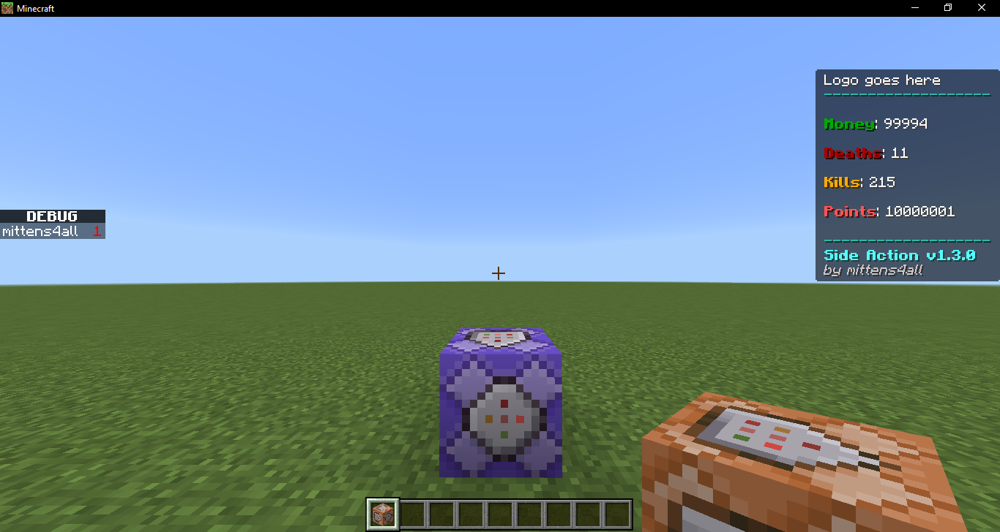

# Side Action

This resource pack sets the actionbar postion to the top middle right and the sidebar to the left.

## Installing the pack:

You may dowload the latest release from the [Releases Page](https://github.com/mittens4all/Side-Action/releases)

Add the Side Action mcpack to your resource packs on your world.

### How to use titleraw on the actionbar to display scores



This example uses the scoreboard objective `Money`. 
After creating an objective, type the following into a command 
block and set it to Repeating, Unconditional, Always Active.
Make sure to place the command block in a ticking area.

```json
titleraw @a actionbar {"rawtext":[{"text":"Money: "}, {"score":{"name":"*", "objective":"money"}}]}
```

## Author

- [@mittens4all](https://www.github.com/mittens4all)
- [Youtube](https://www.youtube.com/@mittens4all)

# Gratitudes

- [@zheaEvyline](https://github.com/zheaEvyline)
- [@coddy2009](https://discord.gg/46JUdQb) \\ Bedrock Add-ons Discord

```js
       _                              _     _       _ _  
      (_)  _     _                   | |   | |     | | | 
 ____  _ _| |_ _| |_ _____ ____   ___| |___| |_____| | | 
|    \| (_   _|_   _) ___ |  _ \ /___)_____  (____ | | | 
| | | | | | |_  | |_| ____| | | |___ |     | / ___ | | | 
|_|_|_|_|  \__)  \__)_____)_| |_(___/      |_\_____|\_)_)
                                                         
```